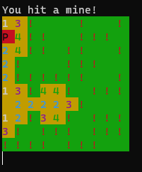

# Minesweeper
A terminal-based clone of minesweeper using python
## Installation
Clone this repo or copy the code from minesweeper.py
## Use
Run in your terminal:
```python3 minesweeper.py```

If you want color, (very useful), run
```pip install bext```

In my terminal it looked like
```
***>python "***\Desktop\python\minesweeper.py"

  _    _    __
 / \  / \  /  \  __  _     _____    ______  _    _    _____     _____    _____    _____    _ __
|   \/   | \__/ |  |/ \   /  __ \  /  ___/ | |  | |  /  __ \   /  __ \  |  _  \  /  __ \  | |  \
|  /\/\  | |  | |      | |   ____| \___  \ | \/\/ | |   ____| |   ____| |   __/ |   ____| |  /\_|
|_/    \_| |__| |__/\__|  \______| /_____/  \_/\_/   \______|  \______| |  |     \______| |_|
                                                                        |__|
                                   Select difficulty level
                                           1. Easy
                                          2. Medium
                                           3. Hard
                                          4. Random
                                 Enter difficulty:
```

When it prompts you for your move enter the x and y coordinates, and if you want to flag it, add something at the end. Enter in the form of XXYYF.

Example: If x is 2 and y is 10, enter "0210"

Example: If x is 9 and y is 3 and you want to flag, enter "0903f" ("f" can be anything)

I don't know how large the grid or how many bombs there are in the original game, so my version might be off.

You can edit how large the grid is and how many bombs there are by editing the DIFF_DATA variable.

## Screenshots





And then

